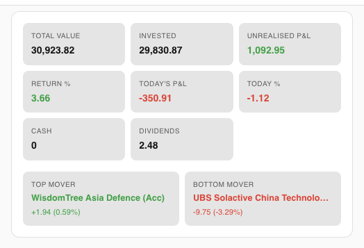
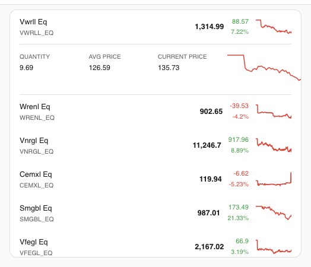
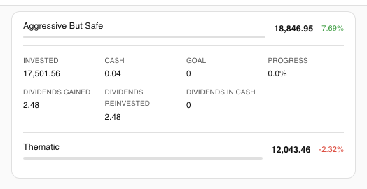
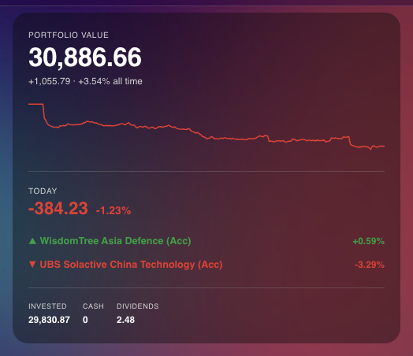

# Trading212 Lovelace Card

[](https://github.com/Smart-Home-Assistant-UK/lovelace-trading212-card/releases)
[](https://github.com/hacs/integration)
[](LICENSE)
[](https://www.home-assistant.io/)
[](https://smarthomeassistant.co.uk)

A Lovelace custom card for [Home Assistant](https://www.home-assistant.io/) that displays your [Trading212](https://www.trading212.com/) investment portfolio — portfolio value with 7-day trend, P&L, positions with sparklines, and pies.

> **Requires the [Trading212 integration](https://github.com/Smart-Home-Assistant-UK/homeassistant-trading212)** to expose your portfolio as sensor entities.


---

## Installation

### Via HACS (recommended)

This card is not yet in the default HACS catalogue, so you need to add it as a custom repository first:

1. Open HACS → **Frontend**
2. Click the three-dot menu (⋮) → **Custom repositories**
3. Enter `https://github.com/Smart-Home-Assistant-UK/lovelace-trading212-card` and set category to **Plugin**
4. Click **Add**, then find **Trading212 Lovelace Card** in the list and install it
5. Reload your browser

### Manual

Download `investment-card.js` from the [latest release](https://github.com/Smart-Home-Assistant-UK/lovelace-trading212-card/releases/latest) and copy it to `config/www/`.

Add it as a Lovelace resource in `configuration.yaml`:

```yaml
lovelace:
  resources:
    - url: /local/investment-card.js
      type: module
```

Or via **Settings → Dashboards → Resources → Add Resource**.

---

## Cards

| Card | Type | Description |
|------|------|-------------|
| Health | `investment-health-card` | Portfolio value, 7-day sparkline, today's P&L and movers |
| Portfolio | `investment-portfolio-card` | All-in-one: overview, positions, and pies |
| Overview | `investment-overview-card` | Account stat grid and daily movers |
| Positions | `investment-positions-card` | Scrollable positions list with sparklines |
| Pies | `investment-pies-card` | Scrollable pies list |

---

## Usage

**Zero-config** — works automatically with the Trading212 integration installed:

```yaml
type: custom:investment-health-card
```

```yaml
type: custom:investment-portfolio-card
```

**Custom sensor prefix** — for any integration following the same naming convention:

```yaml
type: custom:investment-positions-card
prefix: sensor.my_broker_
```

**Explicit sensor mapping** — full control for any sensor source:

```yaml
type: custom:investment-positions-card
positions:
  - name: Apple
    value: sensor.aapl_value
    pnl: sensor.aapl_pnl
    pnl_percent: sensor.aapl_pct
    quantity: sensor.aapl_qty
    avg_price: sensor.aapl_avg
    current_price: sensor.aapl_price
```

---

## Configuration

| Option | Default | Cards | Description |
|--------|---------|-------|-------------|
| `prefix` | `sensor.trading212_` | All | Sensor entity prefix for auto-discovery |
| `max_height` | `400px` | Positions, Pies | Max height of scrollable lists |
| `show_overview` | `true` | Portfolio | Show the overview section |
| `show_positions` | `true` | Portfolio | Show the positions section |
| `show_pies` | `true` | Portfolio | Show the pies section |

---

## Screenshots

### Default theme

| Health | Overview |
|--------|----------|
|  |  |

| Positions | Positions expanded |
|-----------|--------------------|
|  |  |

| Pies | Pies expanded |
|------|---------------|
|  |  |

### iOS dark theme

| Health | Portfolio |
|--------|-----------|
|  |  |

---

## Notes

- **Read-only** — displays data only; no order placement
- **Auto-discovery** — new positions and pies appear automatically without config changes
- **Sparklines** — the health card shows a 7-day portfolio value trend; position rows show per-instrument history from the HA recorder
- **Theming** — all colours and backgrounds use HA CSS custom properties and adapt to any theme automatically
- **Unavailable sensors** — missing or stale entities render as `—` and never cause card errors

---

## Contributing

```bash
npm install
npm run build      # build dist/investment-card.js
npm run dev        # Vite dev server
npm run storybook  # visual component testing
npm test           # unit tests (Vitest)
```

---

## License

[MIT](LICENSE) © Sepehr Sabbagh-pour
