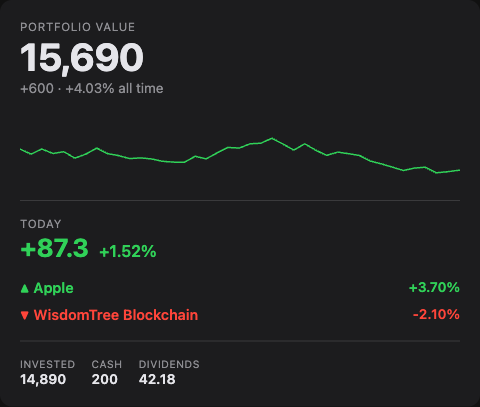
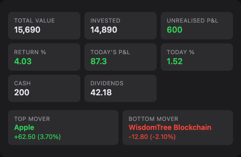
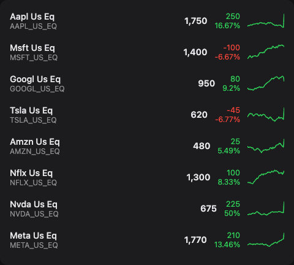
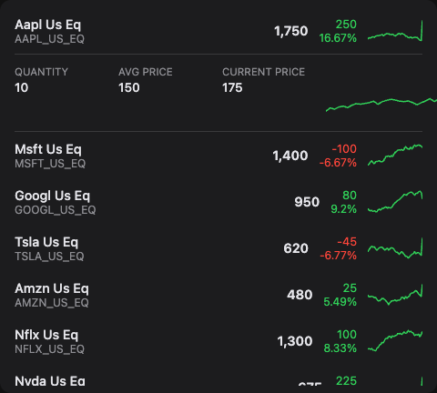
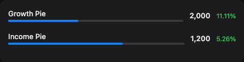
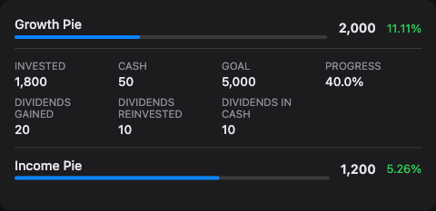
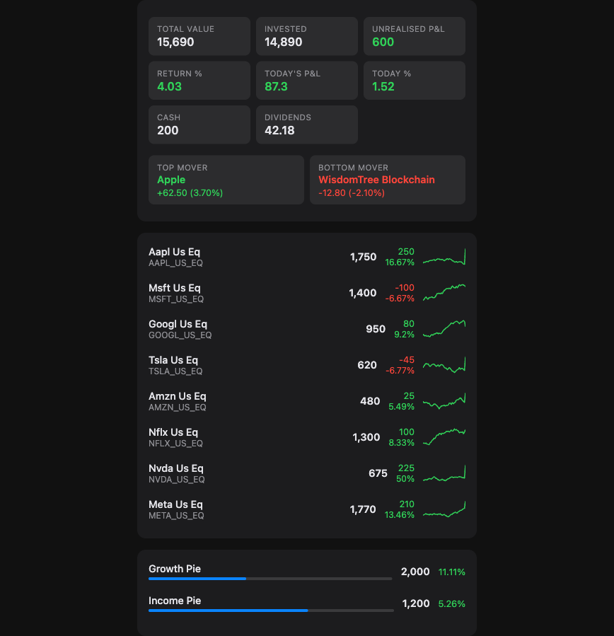
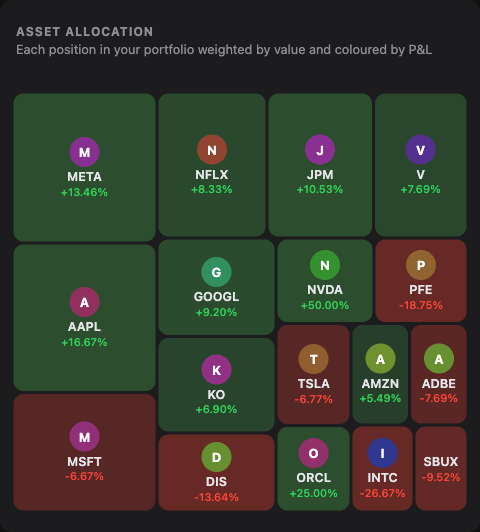
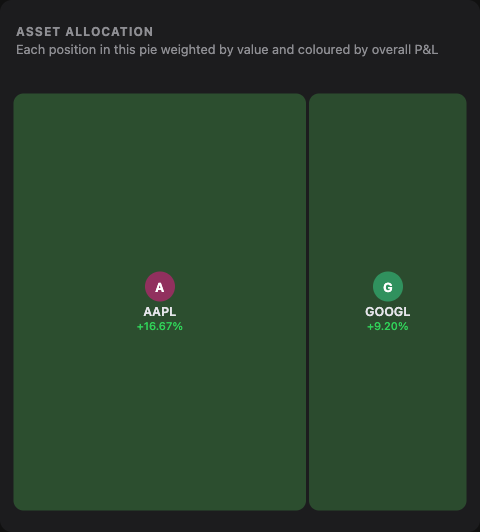
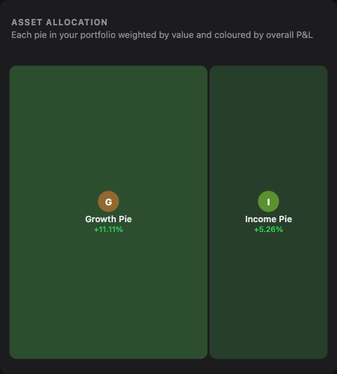

# Trading212 Lovelace Card

[](https://github.com/Smart-Home-Assistant-UK/lovelace-trading212-card/releases)
[](https://github.com/Smart-Home-Assistant-UK/lovelace-trading212-card/actions/workflows/test.yml)
[](https://codecov.io/gh/Smart-Home-Assistant-UK/lovelace-trading212-card)
[](https://github.com/hacs/integration)
[](LICENSE)
[](https://www.home-assistant.io/)
[](https://smarthomeassistant.co.uk)

A Lovelace custom card for [Home Assistant](https://www.home-assistant.io/) that displays your [Trading212](https://www.trading212.com/) investment portfolio — portfolio value with 7-day trend, P&L, positions with sparklines, and pies.

> **Requires the [Trading212 integration](https://github.com/Smart-Home-Assistant-UK/homeassistant-trading212)** to expose your portfolio as sensor entities.



---

## Installation

### Via HACS (recommended)

This card is not yet in the default HACS catalogue, so you need to add it as a custom repository first:

1. Open HACS → **Frontend**
2. Click the three-dot menu (⋮) → **Custom repositories**
3. Enter `https://github.com/Smart-Home-Assistant-UK/lovelace-trading212-card` and set category to **Plugin**
4. Click **Add**, then find **Trading212 Lovelace Card** in the list and install it
5. Reload your browser

### Manual

Download `investment-card.js` from the [latest release](https://github.com/Smart-Home-Assistant-UK/lovelace-trading212-card/releases/latest) and copy it to `config/www/`.

Add it as a Lovelace resource in `configuration.yaml`:

```yaml
lovelace:
  resources:
    - url: /local/investment-card.js
      type: module
```

Or via **Settings → Dashboards → Resources → Add Resource**.

---

## Cards

| Card | Type | Description |
|------|------|-------------|
| Health | `investment-health-card` | Portfolio value, 7-day sparkline, today's P&L and movers |
| Portfolio | `investment-portfolio-card` | All-in-one: overview, positions, and pies |
| Overview | `investment-overview-card` | Account stat grid and daily movers |
| Positions | `investment-positions-card` | Scrollable positions list with sparklines |
| Pies | `investment-pies-card` | Scrollable pies list |
| Allocation | `investment-allocation-card` | Squarified treemap showing portfolio weight and P&L |

---

## Usage

**Zero-config** — works automatically with the Trading212 integration installed:

```yaml
type: custom:investment-health-card
```

```yaml
type: custom:investment-portfolio-card
```

```yaml
type: custom:investment-allocation-card
```

The allocation card supports three modes via the `mode` and `pie` options:

```yaml
# All positions (default)
type: custom:investment-allocation-card

# Positions within a specific pie (see slug convention below)
type: custom:investment-allocation-card
pie: thematic

# Pies overview — each block is one pie
type: custom:investment-allocation-card
mode: pies
```

**Explicit sensor mapping** — full control for any sensor source:

```yaml
type: custom:investment-positions-card
positions:
  - name: Apple
    value: sensor.aapl_value
    pnl: sensor.aapl_pnl
    pnl_percent: sensor.aapl_pct
    quantity: sensor.aapl_qty
    avg_price: sensor.aapl_avg
    current_price: sensor.aapl_price
    daily_gain_loss: sensor.aapl_daily_pnl
    daily_gain_loss_percent: sensor.aapl_daily_pnl_pct
```

---

## Multiple accounts

The Trading212 integration supports multiple accounts side by side (e.g. yours and a partner's). When you add a second integration entry you are prompted to set an **Account Label** — a short name such as `John` or `Jane`. This label is turned into a slug (lowercase, spaces replaced with underscores) and inserted into every entity ID:

| Label | Resulting prefix |
|-------|-----------------|
| *(none)* | `sensor.trading212_` |
| `John` | `sensor.trading212_john_` |
| `Jane` | `sensor.trading212_jane_` |

Point each card at the right account by setting `prefix`:

```yaml
# John's account
type: custom:investment-health-card
prefix: sensor.trading212_john_

# Jane's account
type: custom:investment-health-card
prefix: sensor.trading212_jane_
```

Every card option that accepts a slug (such as `pie`) is relative to the prefix, so no other changes are needed.

---

## Entity slug convention

The integration converts instrument tickers and pie names into slugs for use in entity IDs: **all lowercase, with any non-alphanumeric character replaced by an underscore**.

| Name | Slug |
|------|------|
| `VWRL_EQ` | `vwrl_eq` |
| `Thematic` | `thematic` |
| `Aggressive but safe` | `aggressive_but_safe` |
| `U.S. Tech` | `u_s_tech` |

This matters when using the `pie` option on the allocation card — you must supply the slug form, not the display name:

```yaml
# Pie named "Aggressive but safe"
type: custom:investment-allocation-card
pie: aggressive_but_safe

# Combined with a label prefix
type: custom:investment-allocation-card
prefix: sensor.trading212_john_
pie: aggressive_but_safe
```

---

## Configuration

| Option | Default | Cards | Description |
|--------|---------|-------|-------------|
| `prefix` | `sensor.trading212_` | All | Sensor entity prefix for auto-discovery. Must end with `_`. Set this when using multiple accounts — see [Multiple accounts](#multiple-accounts). |
| `max_height` | `400px` | Positions, Pies | Max height of scrollable lists |
| `show_overview` | `true` | Portfolio | Show the overview section |
| `show_positions` | `true` | Portfolio | Show the positions section |
| `show_pies` | `true` | Portfolio | Show the pies section |
| `mode` | `positions` | Allocation | `positions` (all positions) or `pies` (one block per pie) |
| `pie` | — | Allocation | Slug of the pie to filter positions to (e.g. `thematic`, `aggressive_but_safe`). See [Entity slug convention](#entity-slug-convention). |
| `treemap_height` | `420` | Allocation | Height of the treemap in pixels |

---

## Screenshots

Rendered from the project's Storybook with sample data (not a live account) — see `npm run storybook` under [Contributing](#contributing). Colours, backgrounds, and fonts come entirely from HA's CSS custom properties, so these adapt automatically to whatever theme you're running; there's no separate light/dark variant to maintain here.

| Health | Overview |
|--------|----------|
|  |  |

| Positions | Positions expanded |
|-----------|--------------------|
|  |  |

| Pies | Pies expanded |
|------|---------------|
|  |  |

### Portfolio card



### Allocation card

All three modes — all positions, positions filtered to one pie, and pies overview:

| Positions | Filtered to one pie | Pies |
|-----------|---------------------|------|
|  |  |  |

---

## Notes

- **Read-only** — displays data only; no order placement
- **Auto-discovery** — new positions and pies appear automatically without config changes
- **Sparklines** — the health card shows a 7-day portfolio value trend; position rows show per-instrument history from the HA recorder
- **Theming** — all colours and backgrounds use HA CSS custom properties and adapt to any theme automatically
- **Unavailable sensors** — entities that exist but are temporarily unavailable/unknown render as `—`
- **Optional sensors** — the trading212 integration lets you pick which per-position and per-pie sensors to create; a position or pie shows up as soon as *any* of its sensors exist, and fields for sensors you haven't enabled are simply omitted (no `—` placeholders) rather than requiring every metric to be selected

---

## Contributing

```bash
npm install
npm run build      # build dist/investment-card.js
npm run dev        # Vite dev server
npm run storybook  # visual component testing
npm test           # unit tests (Vitest + jsdom)
npm run test:coverage  # unit tests with a coverage report
```

---

## License

[MIT](LICENSE) © Sepehr Sabbagh-pour
